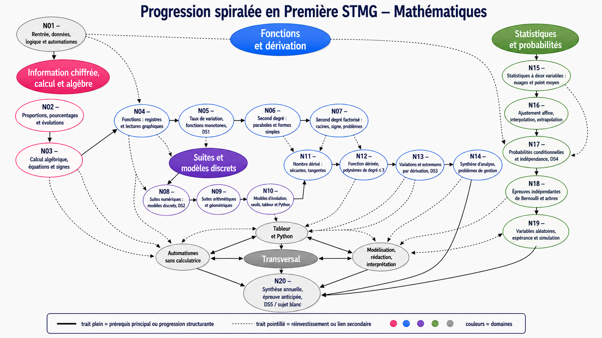

# Progression visuelle

Cette page présentera la carte des notions de Première STMG mathématiques.

L'objectif est de montrer :

- le numéro de chaque notion ;
- son titre ;
- les liens entre les notions ;
- les dépendances importantes.

## Progression calendaire

[Ouvrir la progression calendaire (PDF)](assets/documents/Progression_calendrier_1stmg.pdf)

## Carte de progression

